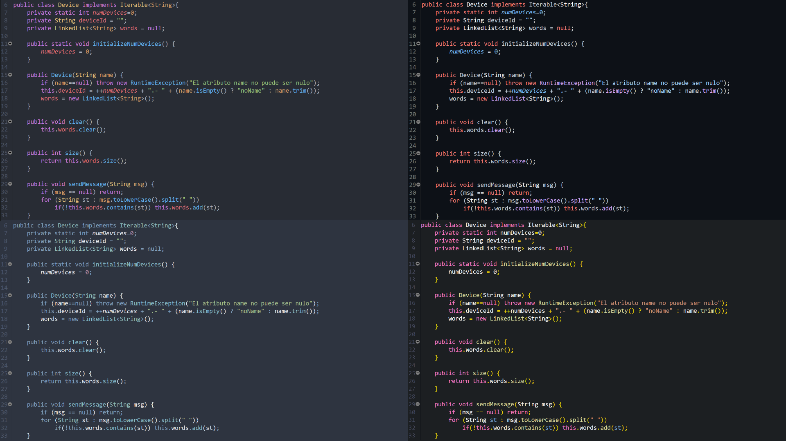

<h1 align="center">
  Eclipse Dev-Style Themes & Theme Helper
  <br>
</h1>

<h4 align="center">Custom and based <a href="https://www.genuitec.com/products/devstyle/" alt="Dev-Style">Dev-Style</a> themes for eclipse and a helper for making your own color theme.</h4>

<p align="center">
  <a href="#how-to-use">How To Use ⚙</a> •
  <a href="#own-theming">Do your own Theme 🛠</a> •
  <a href="#helper">Theme Helper 🖥</a> •
  <a href="#themes">Themes 🖌</a> •
  <a href="#download">Download 📦</a> •
  <a href="#license">License 📜</a>
</p>



<a name="how-to-use"></a>

## How To Use ⚙

The themes are stored in the ``custom-themes`` and ``based-themes`` folders. Its pretty clear what its inside both...Once you have downloaded this repo, just follow the next steps if you are new importing themes into the dev-style eclipse plugin:

```

Open Eclipse:
--> Window -> Prefferences -> Dev-Style -> Color Themes

Then just import the themes that you want:
--> Import -> Select the .xml file of the desired theme
--> Workbench Theme : Dark Custom
--> Set the (H), (S), (L) values to the specified in each theme README.md file 

Restart Eclipse

```

> **Note**
> Obviously you must have installed the Dev-Style plugin wich is available in the Eclipse Marketplace as dev-style. If its not showing, try Darkest Dark Theme.

<a name="own-theming"></a>

## How to Customize your own Theme 🛠
You need to know the following "parameters" or "variables" available in the .xml files:<br><br>

``singleLineComment`` : //this is a single line comment <br>
``multiLineComment`` : /\*this is a multi-line comment\*/ <br>
<br>

 ``javadoc`` : /\*\*this is a javadoc text\*\*/<br>
 ``javadocLink`` : link to a class or other type inside a javadoc text: {@link Class}, from { to }<br>
 ``javadocTag`` : tags inside a javadoc text : @param<br>
 ``javadocKeyword`` : no idea xd, but can share the color with the javadoc tag<br>
<br>
 
 ``keyword`` : **word of the next list**: package, import, public, private, protected, class, enum, interface, module, extends, implements, final, static, this, int, float, double, char.<br>
 <br>
 
 ``class`` : color of the name of any class<br>
 ``enum`` : color of the name of any enum<br>
 ``interface`` : color of the name of any interface<br>
 <br>

``method`` : color of the name of any normal method<br>
``methodDeclaration``: color of the name of any normal method when is declared (created)<br>
``staticMethod`` : color of the name of any static method<br>
``inheritedMethod`` : color of the name of any inherited method (f.e: equals, toString (methods from superclasses))<br>
``abstractMethod`` : color of the name of any abstract method<br>
<br>

``bracket`` : [], {}, <>. ()<br>
``number`` : any number<br>
``string`` : any string typed as ""<br>
``operator`` : +,-,*,/<br>
<br>

``field`` : name of a variable that is declarated in a class (f.e: private int i, where i is colored)<br>
``staticField`` : color of a static field<br>
``staticFinalField`` : color of a static finel field<br>
``parameterVariable`` : color of a parameter in a method<br>
``localVariableDeclaration`` : color of a local variable when declared (f.e: variable inside a method)<br>
``localVariable`` : color color of a local variable<br>
``costant`` : color of a constant<br>
<br>

``lineNumber`` : color of the Eclipse editor line numbers<br>
``currentLine`` : color of the current editor line<br>
``selectionBackground`` : color of the background selected text<br>
``selectionBackground`` : color of the foreground selected text<br>
<br>

``deprecatedMember`` : color of a element when its deprecated<br>
``annotation`` : color of a Eclipse annotation<br>
<br>

> **Note**
> After reading this, you can make your custom theme by using the <b><a href="https://filipondios.github.io/edste/">Theme Helper</a></b> and then copiying the hexadecimal color values to your ``.xml`` theme file. 

<a name="themes"></a>

## Themes 🖌

<details><summary>BASED THEMES</summary>
<p>

### One Dark


### Nord


### Ayu Dark

  
### Github Dark Theme


### IntelliJ Darcula Theme


</p>
</details>

<details><summary>CUSTOM THEMES</summary>
<p>

### Filipondios Dark Theme I


### Filipondios Dark Theme II


</p>
</details>

<a name="helper"></a>

## Using the Theme Helper 🖥
You can access to the Theme helper by visiting the editor website <b><a href="https://filipondios.github.io/edste/">edste</a></b>
<ins>*(Eclipse Dev Style Theme Editor).*</ins> There you can change some values of the theme colors, to see a preview of how the theme should be. The colors change at the same time as you write the input in the boxes. If you see that a color is not applied, press enter.

<a name="download"></a>

## Download 📦
You can git clone this repo or just download the <a href="https://codeload.github.com/Filipondios/Eclipse-Dev-Style-Themes/zip/refs/heads/main">zip</a> with all the files.

<a name="license"></a>

## License 📜
GNU - See the license <a href="LICENSE">file</a>.

---

> GitHub [@Filipondios](https://github.com/Filipondios) &nbsp;&middot;&nbsp;
> Discord [ꜰɪʟɪᴘᴏɴᴅɪᴏꜱ#9621](https://discord.com)

